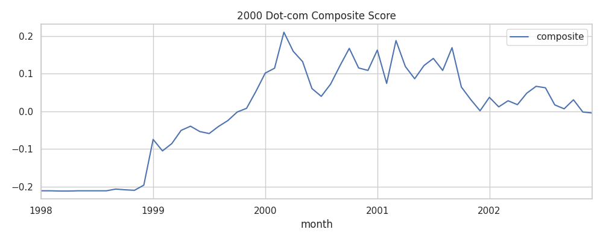
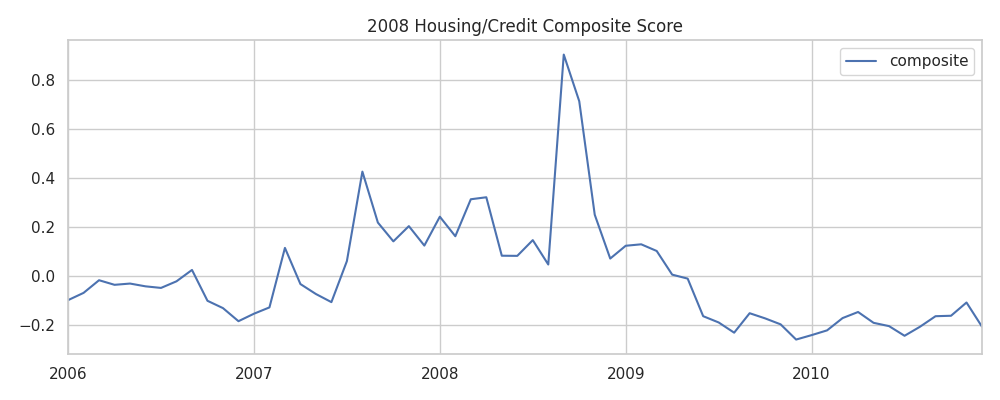
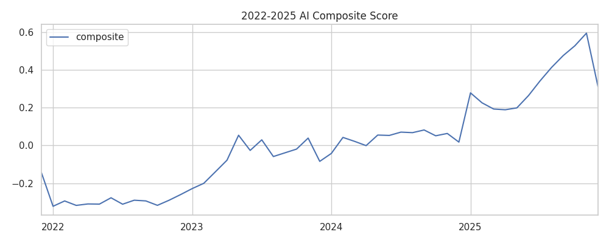

# AI 金融泡沫对比量化报告

生成时间：2025-12-26 20:49

## 结论摘要
- 与2000年科网泡沫的相似度（皮尔逊/余弦/DTW-like）：0.927, 0.562, 0.832
- 与2008年房地产/信用周期的相似度（皮尔逊/余弦/DTW-like）：0.329, 0.748, 0.704
- 当前AI复合泡沫分数：0.3104053509690219 | 风险判断：高风险

## 方法与数据
- 市场特征：指数与ETF价格动量（3/6/12个月）、动量加速度、成交量相对12个月均值的放大。
- 媒体强度：The Guardian 关键词月度篇数（1999年至今）、Google Trends 搜索热度（2004年至今）。
- 综合分数：上述标准化特征的加权和；权重偏向价格加速度与媒体热度。
- 峰值对齐：取各周期复合分数的峰值前12个月进行窗口对齐并比较。

## 可视化

## 当前AI龙头估值快照（非历史对比）
Ticker | 市值 | Trailing PE | Forward PE | PS(TTM)

- NVDA: 4.66T, PE(TTM)=47.41213, PE(FWD)=25.358007, PS=24.919828
- MSFT: 3.62T, PE(TTM)=34.69466, PE(FWD)=26.008436, PS=12.332277
- GOOGL: 3.80T, PE(TTM)=30.884731, PE(FWD)=27.980568, PS=9.849921
- META: 1.67T, PE(TTM)=29.311535, PE(FWD)=21.999008, PS=8.824734
- AVGO: 1.67T, PE(TTM)=74.068275, PE(FWD)=25.181398, PS=26.165058
- AMD: 350.0B, PE(TTM)=112.541885, PE(FWD)=33.28116, PS=10.926133
- SMCI: 18.3B, PE(TTM)=24.18504, PE(FWD)=10.091635, PS=0.87096083

注：估值仅用于刻画当前热度与基本面匹配度，历史估值无法完整可得，故不纳入相似度计算。

## 局限性与说明
- Google Trends 不覆盖2000年前后，科网周期主要依赖报纸与市场数据。
- 估值历史数据粒度有限，本工具以价格与媒体热度为主，估值仅作为定性参考。
- 本报告仅供研究参考，不构成投资建议。
